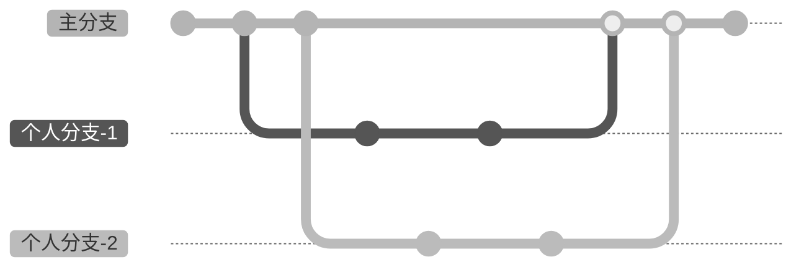
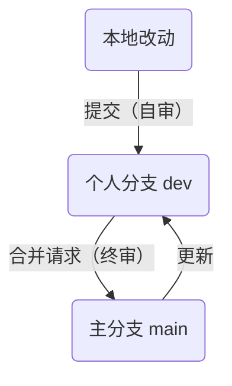

# Git 基操

## ⌛️ 时间机器

数字工作离不开版本管理（Version Control），你可以把 Git 想象成「时间机器」，它不仅负责记录、回溯时间点。还能允许你分裂、跳跃、合并时间线。

在 Git 中，提交（Commit）就是时间点；分支（Branch）就是时间线。Git 有很多实践流派，偶魔采用的是 [GitHub Flow](https://docs.github.com/zh/get-started/using-github/github-flow) 简化版：

为了方便初学者理解，我用直白的语言表述：

1. 仅在自己的「个人分支」工作，互不干扰
2. 通过「提交」，有选择地确认改动到个人分支
3. 不时地更新其他人在「主分支」的改动
4. 通过「合并请求」，有监督地确认改动到主分支

通过双审核机制，本地改动最终更新到主分支上。这样，即解放了本地创作限制，又规范了线上协作流程。有效避免了同步网盘方案中，高频改动导致的文件冲突问题，以及 AI 操作导致的潜在安全风险。

接下来，我将说明具体的操作（确保已安装 Git、VS Code，详见 [必装软件/工具](starter.md)）

### 仅在自己的「个人分支」工作

**1. 下载仓库（Repository）**

浏览器打开仓库地址 <https://git.omoolab.xyz/[orgn-name]/[repo-name]>，点右上的 Code 按钮，点击 Open with VS Code（如果没效果，用命令行）

或执行 `git clone [git-url]`  

> 有些仓库默认不拉取大文件
> 通过执行 `git lfs pull --exclude= --include [folder]` 来下载仅需的文件夹

**2. 创建个人分支**

点左下角的`main`，点击 Create new branch...，然后输入分支名`[your-name]/[do-something]`(比如`manan/dev`)

或执行 `git checkout -b [your-name]/[do-something]`

但这个分支目前只在本地，需要推送分支到远程。这样远程仓库也能存有属于你的分支了

或执行 `git push -u origin [branch-name]`

分支列表中有一些 `origin/*` 开头的分支，它们是属于远程仓库中的分支。但注意，这不代表它们存在于远程！想象一下，如果你处于断网状态，那么实际上这些 `origin/*` 分支也没有获得更新。而且它们的状态不会自动更新，除非你执行 `git fetch`、`git pull`、`git push`。

### 通过「提交」来确认改动到个人分支

**1. 有选择性地添加（Add）改动**

任何较上次提交的变动都会罗列在 Changes 下，点击条目右边的 + 按钮来添加（只添加你认可的改动），条目会切换到 Staged Changes 下。你也可以点击 Changes 右边的 + 按钮来添加所有改动。

或执行 `git add [file]`

**2. 提交（Commit）改动**

提交还需要说明信息（Commit Message），要求言简意赅（点击小星按钮让 AI 来帮忙总结）。

填写后，点击 Commit 按钮来完成提交。

或执行 `git commit -m [message]`

**3. 推送（Push）到远程仓库的个人分支**

虽然提交已经完成，但远程仓库仍然没有更新。我们需要通过推送，由本地同步给远程。（相反，由远程同步给本地的操作，叫拉取（Pull））

点击三个点按钮打开菜单，点击 Push 按钮

或执行 `git push`

这步是工作中最常用的：一边工作，一边适时地 Add > Commit > Push

### 更新其他人在「主分支」的改动

当你在自己分支工作时，其他人也在不断改动主分支`main`。有时需要对齐一下，拉取（Pull）并合并（Merge）来自主分支的更新到你自己的分支。

点击 … 按钮打开菜单，点击 Pull from...，并选择`origin/main`（注意不是`main`分支，它是本地的，不一定最新）

或执行 `git pull origin main`

如果冲突，会进入`([branch-name]|MERGING)` 状态，详见 [解决冲突](#解决合并冲突)

### 通过「合并请求」来确认改动到主分支

合并请求（Pull Request，PR）就是个人分支合并入主分支的申请。

> ⚠️ 在提 PR 前，**一定**要在本地执行 [同步「主分支」的改动](#同步「主分支」的改动)（且同步给了远程仓库的个人分支）

浏览器访问仓库主页，切换到个人分支，点击 New Pull Request 按钮（3）

确认一下合并方向是否正确，然后填写 PR 标题和内容（改了什么，加了什么），最后点击 Create Pull Request

PR 会加入队列，等待审核通过。通过后就会合并到主分支啦。

> 在提 PR 后，如果你又更新了你的分支，不必再次提 PR

## 最佳实践

### 多设备编辑同一分支

首先不推荐这样做，但是为了一个设备，新加分支也很没必要。但如果由一个人操作这些设备，比如个人的 macbook、iphone 共同编辑，只要严格遵守下面两条：
- 在 A 设备编辑，Commit 后立即 Push，以保证远程仓库及时更新
- 切换到 B 设备，在编辑前立即 Pull，以保证 B 设备及时更新

> 为什么不用 icloud？因为这样可以实现部分同步，能适应复杂的文件夹，打开也更快。

### 解决合并冲突

解决完冲突后，继续

或执行 `git merge --continue`

或者退出，不解决

或执行 `git merge --abort`

大文件处理完合并后，变成指针文件  
执行 `git lfs pull` 拉回原始文件

### 虽然文件 ignore 了，但因为曾经加过，所以还在被追踪

取消曾经追踪过的文件，但不删除文件

执行 `git rm --cached [file]`

### 个人分支的提交记录，本地和远程仓库不一致

执行 `git push --force-with-lease`